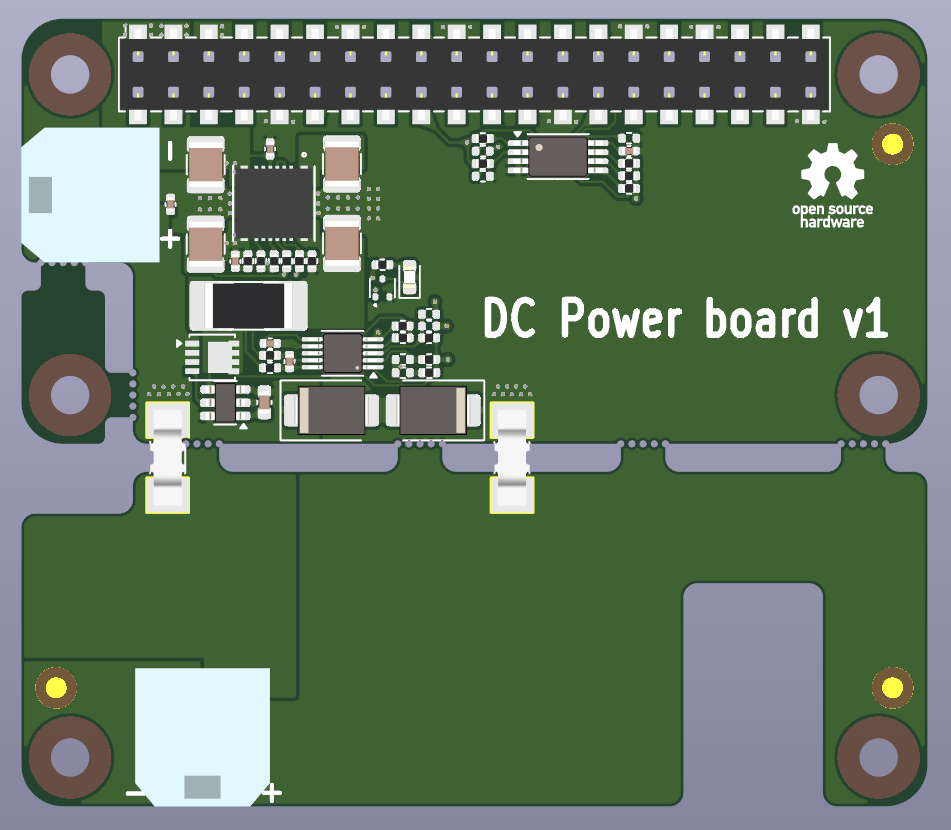

# dc-power-board
9-36V DC input 5.1V/5A output board for Raspberry Pi



## Features
- 9-36V DC input
- 5.1V/5A output(sufficient to power Raspberry Pi5)
- Reverse polarity protection
- INA226 current, voltage and power monitor
- EEPROM for board identification

## EEPROM
### eep file preparation
```eepmake ./dc_power_board_v1_eeprom.txt dc_power_board_v1.eep```
### EEPROM flashing
Short TP1 and TP2 or short R24 to disable EEPROM write protection. \
Run: ```sudo eepflash.sh -w -f=dc_power_board_v1.eep -t=24c32 -a=53```

## Device tree overlay
### Device tree overlay compilation
```dtc -@ -Hepapr -I dts -O dtb -o dc-power-board-v1.dtbo dc-power-board-v1.dts```

### dtbo installation
Copy ```dc-power-board-v1.dtbo``` to the ```/boot/overlays/``` directory.

## Power monitor usage
### Get current in mA
```cat /sys/devices/platform/soc/fe804000.i2c/i2c-1/1-0045/hwmon/hwmon2/curr1_input```

### Get voltage in mV
```cat /sys/devices/platform/soc/fe804000.i2c/i2c-1/1-0045/hwmon/hwmon2/in1_input```

### Get power in mW
```cat /sys/devices/platform/soc/fe804000.i2c/i2c-1/1-0045/hwmon/hwmon2/power1_input```